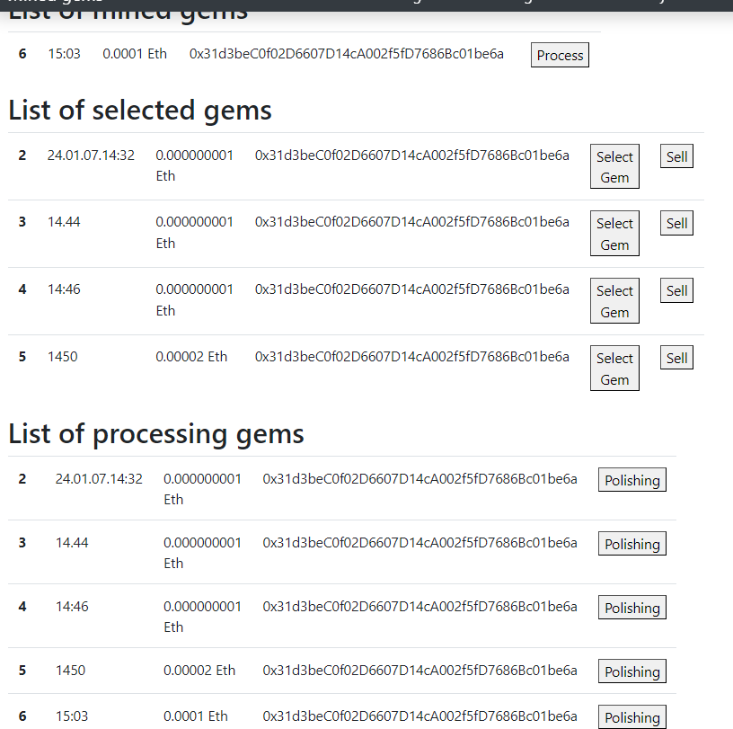
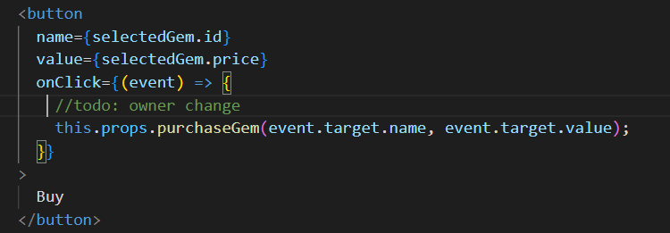
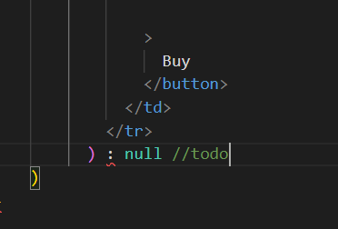
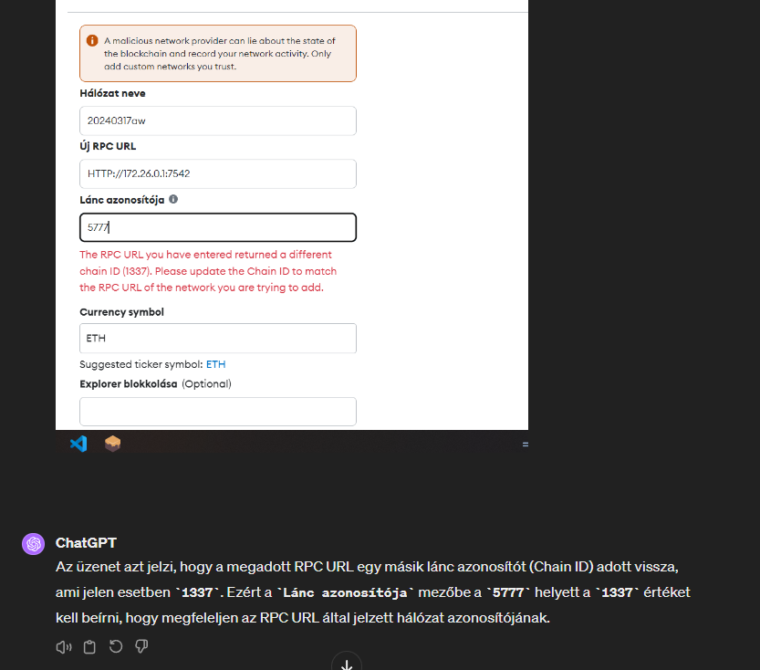
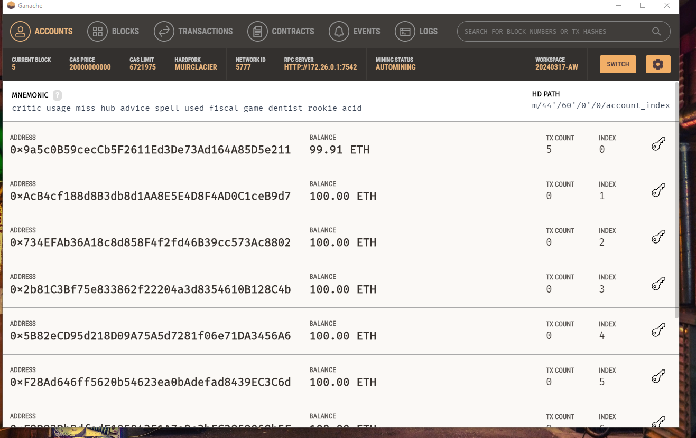
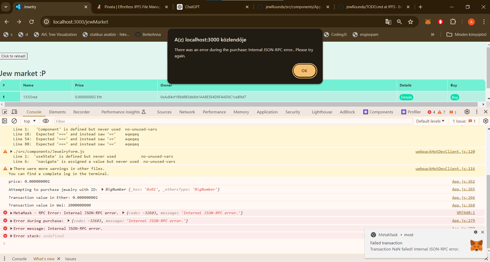
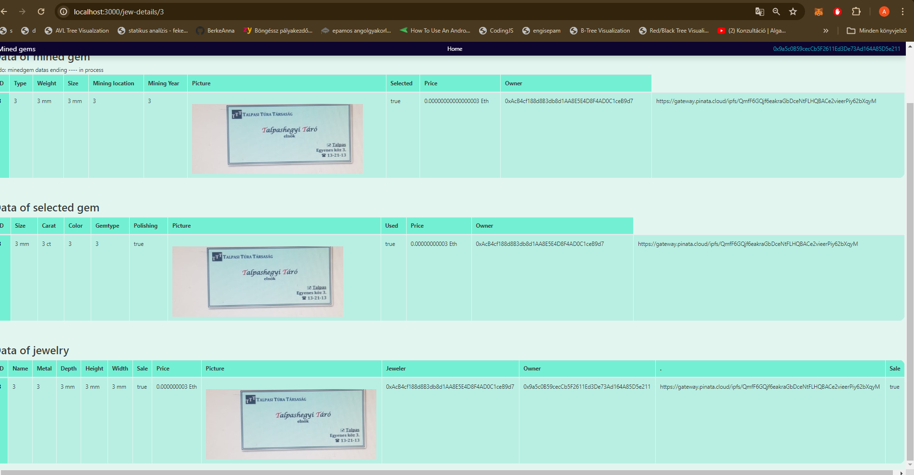
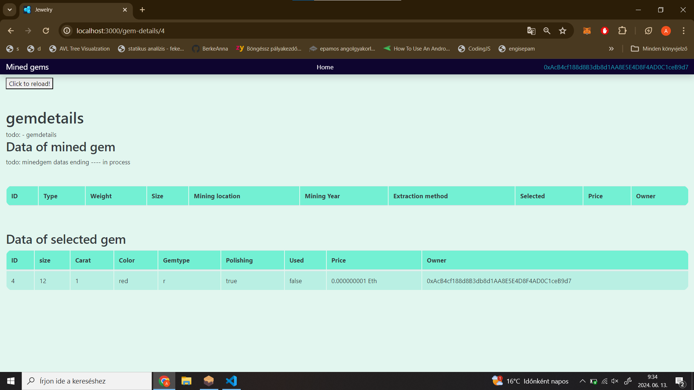
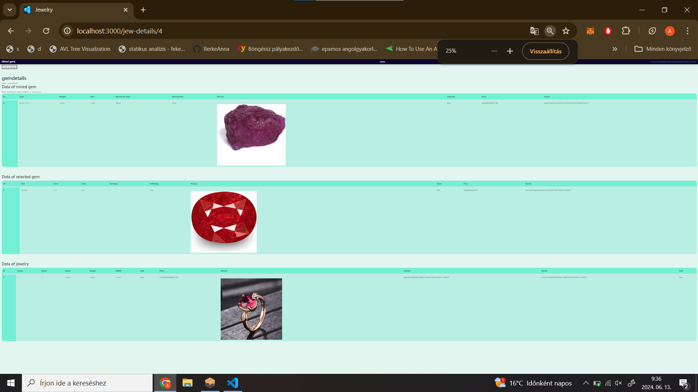
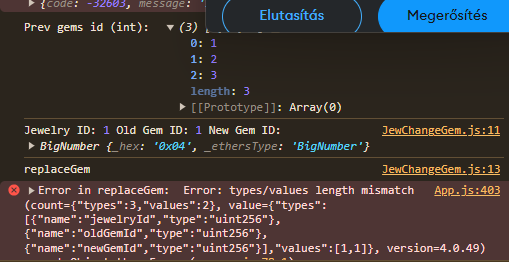

2023.12.31.
Ha List of selected gems ben megnyomom a selectgemet, akkor kitöltöm a formot és beírja a List of processing gems-hez is, de az elsőből nem törli

----jav: már alapból mindkettőben kilistázza

Ezt kellene javítani, hogy az egyikből törölje. 
AMiket én töröltem az a notepad: új 19, 20 , 21,22

12:31: 13:18:
kilistázni a selected formmal hozzáaadottakat. 
javítani a selected gem gombot, hogy a extractionmethodban módosítsa a selected boolt true-ra és nyissa meg a selectedformot

2024.01.07. 14:35 :
Kibányászott kő -> process gomb -> List of selected gems listába kerül. Előzőből törlődik.
List of selected gems-ben katt a "select gem" gmbra -> selected form feljön. -> kitöltöm -> HIBÁS RESULTS:
                    1. List of selected gems listában bennemarad a selected gem
                    2. ugyanaz a sor a List of processing gemsné, ami a List of selected gems-ben selected lett, ugyanúgy megjelenik.
                    3. a List of processing gems-ben a selected formmal hozzáadott adatok megjelenennek egy új sorban. (de így igazából 2x szerepel)

2024.01.07. 15:06:
    Most a 2. 2 tábla dupláz, de :
    

2024.01.07. 19:46:
    Most ha a második táblában rámegyek a selectgemre, akkor utána ottmarad, de az alsó táblába ez is és egy selected sor is bekerül

2024.01.07. 20:26:
    Most a második táblából törlődik. Egy problem:
        a processinggemsnél kilistézza a "minedgem"-et és a "sleectedgem"-et is két külön sorba.
        ----> ezt kellene megcsinálni hogy vagy minden egy sorban legyen, vagy csak a selected látszódjon, és ha rámegyünk egy details gombra akkor mindent a minedről is 

        
2024.01.07. 21:07:
    Most a 3. táblában csak a selectedformosokat jelzi. És törli az előzőkből. Ez jó.
    Todo:
        - a processing gems végére a polishing gomb használata után egy details gomb, ahol összeköti a minedgemet a selectedgem adatokkal és kilistázza az összeset egy oldalon.
        - többihez is details?
        - ékszeres contract

2024.1.12. 20:22
        - detail gomb megjelenik a polishing helyett, ha megvolt a polishing. A details gomb még nem működik.
        - ezek továbbra is todo:
              - a processing gems végére a polishing gomb használata után egy details gomb, ahol összeköti a minedgemet a selectedgem adatokkal és kilistázza az összeset egy oldalon.
                - többihez is details?
                - ékszeres contract

2024.01.23. 10:55
        - ékszeres contract
        - sell gomb -> drágakőpiacra kikerül a kő
        - 

2024.01.26. 13:22
        - nem kell sell gomb. Auto kikerül a piacra, a sell gomb helyett making -> ürlap-> új ékszer

2024.01.26. 14:19
        - jewelry form átírása

2024.01.26. 18:32
        - jewelry form után a own mined gems oldalon a listázásba új tábla, előzőből törlés

2024.01.27. 19:24.
        - jewelry táblában gombokat megcsinálni

2024.01.27. 20:02.
        - list of proc. gems-nél sell gomb -> gem piac --- nooo nem kell sell gomb, alapból kikerül
        - list of jew. sorokban sell gomb -> jew. piac --- nooo nem kell sell gomb, alapból kikerül
        - contractokba require-k, amik ellenőrzik, hogy pl a sleected gem mérete nem lehet nagyobb a minedgemnél
        
        -gem market buy gomb nem jó, gondolom az owner miatt
        

2024.01.28. 20:45:
        - a data of jew a detailsen belül a jewmarketben nem ír semmit. miért?
        --- most az a problem, hogy a detailsnál csak azokat listázza ki amit a user adott meg, mást nem

2024.01.28. 21:41:
        - most ha betöltöd a http://localhost:3000/ oldalt nincs navbar, ha a Login gombra mész akkor rá kell frissíteni, hogy 
                látszódjn a navbar. És ha visszalépsz akkor is h eltűnjkön

2024.01.29. 9:19:
        - navbar még minding

2024.02.02. 8:49:
        -problem: ha a selectingnél rossz adatot adunk meg, akkor ha kilép a formból már nem tujuk használni, mert már a selectgem gombbal eltűntetjük  
        - és nem működik a form - jrpc errort kapok, valami nem jó, hiába adok kisebb, nagyobb, egyenlő értéket. meg kell keresni a problemet, de azért ezeket is újra ellenőrizni. a remixen elvileg működik

        skálázható mérés

2024.02.07. 10:26:
        - gemtype nem változik, szóval nem kell megadni a formban, hanem csak vigye tovább
        - megcserélni a selectgemnél a gombokat, előszőr menjen a form, utána a "törlés", mert így ha rosszul adom meg a formban az adatokat és kilépek, a minedgem eltűnik, de már nem tudom selectelni
        - jew.sol-ban a price - require
        - a minedgem.sol-ban require -> hogy nagyobb legyenek, mint 0 az értékek :D

2024.02.09. 9:04: 
        - ~~gemtype nem változik, szóval nem kell megadni a formban, hanem csak vigye tovább~~ használom tovább még  
        - megcserélni a selectgemnél a gombokat, előszőr menjen a form, utána a "törlés", mert így ha rosszul adom meg a formban az adatokat és kilépek, a minedgem eltűnik, de már nem tudom selectelni 
        - ~~a minedgem.sol-ban require -> hogy nagyobb legyenek, mint 0 az értékek :D~~ 
        - a marketben a buy gomb is kell 
        - ~~táblákban a mértékegységek~~ 
        - gem marketet is megcsinálni, hogy látszódjanak az eladó kövek 
        - ~~megcsinálni egy lekérőt, ami id alapján úgyanúgy kilistázza az adatokat - külön ékszerre fix,~~ de lehet kőre is kell a gem market miatt?? 
        - problem: a ownedbyuser - >List of processing gems details csak azt listázza ki amit a userhez lehet kötin, user adott hozzá. de ez már a marketnél meg van oldva 
        - ha más sorrendben csinálom a kövek feldolgozását átírja az összes id-t. PL ha a minedgem 9-es id, de a jewnél 2-est kap, akkor minedt átírja  

2024.02.22. 17.01: 
        most ott a file kiválaszt, de ha hozzéáadom hibát kapok, de nélküle elmegy a form  

2024.02.23. 18:28: 
        - ~~ a minedgem foromt megcsinálni most jók a contractok~~ 
        - a képek felmennek a pinataba, elmegy a form :D de a process gomb nem működik és a képet sem jeleníti meg 
        - ~~a mainen működik a process gomb~~  
        - most az add product nem működik - a gázlimittel lesz a gond itt is--- errort ad a tranzakciónál.  

2024.02.29. 13:56: 
        - grinding? A gemselben? appjsbennincs... 
        ~~- details gomb nem jó.... ~~
        - a gemstoneSelecting sol struct-ot módosítottam, szóval az app.jst és a formot is javítani kell még :D   

2024.03.03. 16:27: 
        - a jewmakinghez kell a fileurl, a formban és az app.js-ben és a képfeltöltés is

2024.03.05. 15:13 
        - hozzáaádja a jewelryt csak az ownedbyuser oldalonn nem jelenik meg az új sor, de todo
        - 15:15: sorry, megjelenik

2024.03.06. 19:15: 
        - a jewdetailsban nem jelenik meg a kép
        - a List of processing gems részben pedig állítsni kell a markasused-ot
        - van egy kis problem az id-kal. ha nem sorrendbe megyunk a kövekkel a lépéseken gond van...

2024.03.17. 11:22:  
       ~~ - new ganache: 20240317-aw --- a metamaskban hozzáadni új addresseket ~~ 
       - ha létrehozol egy új ganache workspace-t, akkor a metamaskban is hozzá kell adni a hálózatot manuálisan: 
        
       
2024.03.17. 13:01: 
        - az id-k megoldása: a create függvényekben van  agond, mert ott új id-t generál, nem veszi át a szülő idját., hanem a count alapján növeli
        --> most ha hozzáadok két minedgemet, és utána lesz selected visszafelé irányba, szóval előszőr a 2.ak sleectelem, akkor az csak akkor jeleink meg ha az előtte lévő is --- de így az id nem  rossz ---- 13:37: most jók a köve sora :D

 2024.03.19. 13:26:  
       ~~ - az id-s gond a makeJewnél is fennáll. Azt javítani.  ~~
    ~~    - ha megvan a makejew, akkor tötölje a List of processing gems-ből is. mert most ottmarad ~~
       ~~ - órán tesztelni, hogy most az id-k jók e a jewmakingben is :D ~~
        - processing gemnél csak akkor jelenik meg egy id, ha az előtte lévőek már ott vannak. szóval, ha csak  a2es id-jú megy át proc-ra, akkor nem látszik. De ha utána hozzáadom az 1. id-sat akkor mind2 látszik  

2024.03.22. 17:43:  
        ~~- a http://localhost:3000/gem-details/{id} oldfalon rossz a megjelenítés ~~
        ~~-gem marketnél kell detail gomb, nem elég a buy ~~
        - a gem marketnél a buy gomb hibára fut másik usernél 
        - a sell gombot az owner oldalon ki lehet dobni 
        - majd kell előszőr egy login - select jew oldal. És a belépés után lehet a marketekbe navigálni 
                ->>> van egy dashboard, ahol be lehet loginelni és van egy kereső a jewekhez
                ->>> ha van egy belépett felhasználó, akkor egy másik középen látszó menü lesz:
                        --->>>> üdv xy.
                        ---->>>> saját termékek gomb
                        ---->>> add mined gem gomb
                        ----> gem market gomb
                        ---->>> jew market
                ---- viszont jew market mehetne a látogató felületre is. Mert mi van, ha ezen az oldalon akarja megvásárolni? De lehet elég lesz az, hogy ez a kereskedőlnek van. De vendég lekérheti az adatokat, de itt nem tud venni.
                
      ~~- http://localhost:3000/gemMarket ez nem ugyanaz http://localhost:3000/minedGems~~

2024.05.22. 9:19:  
        -"kamu" login megvan....
        - lekérni bejelenetkezés nnélkül nem lehet adatot.

2024.05.23. 12:56 
Pinata adatai: ha .envbe rakom, akkor = jel kell, nem : ; de van egy dotenv.md. az is ok
API Key: 2a0693137f6649c4a2bc
API Secret: 4a4396e429b8b89395bd093448e9eaf37f06569e8a9eebb1bc1c44a15516a7cf
JWT: eyJhbGciOiJIUzI1NiIsInR5cCI6IkpXVCJ9.eyJ1c2VySW5mb3JtYXRpb24iOnsiaWQiOiI2OTllN2I4Zi0wZjUzLTQ4OGYtYjgzNS0xODA2ZGI3Mjc5MjciLCJlbWFpbCI6ImJlcmtlLmFubmEudkBnbWFpbC5jb20iLCJlbWFpbF92ZXJpZmllZCI6dHJ1ZSwicGluX3BvbGljeSI6eyJyZWdpb25zIjpbeyJpZCI6IkZSQTEiLCJkZXNpcmVkUmVwbGljYXRpb25Db3VudCI6MX0seyJpZCI6Ik5ZQzEiLCJkZXNpcmVkUmVwbGljYXRpb25Db3VudCI6MX1dLCJ2ZXJzaW9uIjoxfSwibWZhX2VuYWJsZWQiOmZhbHNlLCJzdGF0dXMiOiJBQ1RJVkUifSwiYXV0aGVudGljYXRpb25UeXBlIjoic2NvcGVkS2V5Iiwic2NvcGVkS2V5S2V5IjoiMmEwNjkzMTM3ZjY2NDljNGEyYmMiLCJzY29wZWRLZXlTZWNyZXQiOiI0YTQzOTZlNDI5YjhiODkzOTViZDA5MzQ0OGU5ZWFmMzdmMDY1NjllOGE5ZWViYjFiYzFjNDRhMTU1MTZhN2NmIiwiaWF0IjoxNzA4NTA2MDY0fQ.JTmo7mmMjjspnoLOGdqinVWp2cw5UutrSKSh8dwBUBE
        

  
2024.05.23. 13:15 
-A list of processing gems-ig jó. 
- utána a make jewelry formmal van gond, a gomb átirányít a formra, nem írt hibát, de a kész jewek között nem látom az újat. - 05.23.13:39: nyílván csak lassanadja be a adatokat, mert mostmár látszik az előző -- jah, ha most http://localhost:3000/jew-details/8 erre rám,egyek, mert ez a 8. , akkor látom a selected gemig, de a jewelry még nincs ott, de az owned oldalról már törlődött   --- a jewmarketben csak másét látni!!! de az owned oldalon ott van és jó is :D (13:57)
http://localhost:3000/jewelry-making/gem/8 

- majd különszedni a usereket regisztrációval, hogy csak kereskedőről van szó, vagy vásárlóról, vagy vendégről 
- //a tranzakció kellene !!!! de valami nem jóóóó - app.js 
        -> sokkal nagyobb összeget ad át a metamasknak. miért? 
14:46:
 
-most átadja a jó összeget, de hibára fut:  - There was an error during the purchase: Internal JSON-RPC error.. Please try again.
Ezt javítani!!!

2024.06.12.11:30:
MŰKÖDIK A BUYJEWELRY FÜGGVÉNY! HA MEGVESZI AKKOR JÓÓÓÓÓÓÓÓÓÓÓ!!!! 

2024.06.13. 9:15:
~~ - gem marketen nem jelenik meg semmi ~~
~~ - nem látszik az előzők adatai, a gem detailsnál, ha a gemet más veszi meg. ~~

~~ - de ha utána megcsinálom a make jewet, akkor utána látzik az eredeti bányász adatiai is. Akkor a gem odlalon van vmi hiba. Javítani! ~~

2024.06.18. 9:50:
- a gem-details oldalon nincsenek még képek megjelenítve
- meg kellene nézni, hogy a fizetésekkel - összegekkel mizu. 
        -> ha megveszünk vmit, akkor mi hova kerül?
        -> a transaction fv csak egynél lett meg?
        
2024.06.18. 11:02:
- most nincs olyan, hogy "sell", ha van egy kész jewelrym, akár én csináltam, akár más. Ha a jewelry táblámban van, akkor auto benne van a jew marketben és bárki megveheti. -> javítani kell, hogy csak akkor legyen rajta a marketen, ha eladom.
- de egy idő után eltűntek vagy én nem értem ki hova lett. Kövileg ezt a vevős részt egy migrate után, hogy ne legyen más adat. mert így valami bezavart és lett egy rossz tranzakció, ami után default 0 értékeket  adott.

2024.06.18. 13:27:
- buyJewelry függvényben (Jewelry.sol) működik a transfer . Az eladó megkapja az összeget. A többinél is meg kell csinálni.

2024.06.19. 8:55:
        - Gemmining fv az addMInedGem odlalon nem vonja le a pricet- csak a gátzköltségeket. Ez jóóóó
        - Process gomb - ownedMinedgems - ő levont 1 ETH-t saját magától és gondolom a szerződés kapta...
     !  - a gem marketen a megvételnél csak a gázok mentek. maga az 1 ETH nem. Ezt javítani! (select gem)
        - make jewelryben is csak a gázok csökkentek. Ez is jóóóó
        - jew marketen a buy gomb használata során működik a tranzakció. Az adó megkapja, a vevőtől levonja az ETH-t
        - mikor már megvettem a jewet a visszavétel működik! -igen, ilyenkor az eredeti tulaj látja a jewmarketen. És vissza tudja vásárolni - ugyanúgy megtörténik a tranzakció

2024.06.23. 18:08:
        - ahova a ! jel van rakva elvileg megcsináltam. Felkommitolom.

2024.07.01. 15:00
        -most ha csatl. a metamask, akkor a loginnal kiírja a addresst, majd logoutolhat.
        - az kellene , hogy most loginnál kiírja, hogy melyik "tárca" van használatban. ha még nincs hozzá fiók, akkor lesz alatta egy logout, és egy regisztráció. 
        - ha van már fiók akkor egy login lesz latta. és beenged lépni

2024.07.04. 23:02
        -Tesztelni a legutóbb felkommitoltat, az előtti elvileg jó, itt is tesztelni a formokat!!!!

2024.07.10.15:58:
        - a userRegistryhez hozzáaadtam a rolet, lehet vele később hiba...

2024.07.12. 8:53:
        - most kiírja a user adatokat a profil oldalon.

2024.07.12. 9:05:
        - Owned Jewelry Count kiírja  a profilon

2024.07.13. 10:32:
        -most a prfilon úgy néz ki, hogy a jelenleg birtokolt ékszereket összeszámmolja.
        - a mined gemeknél ugye nem változik a miner, szóval kilistázza eddig összesen mennyi követ bányászott az adott user.

2024.07.14. 22:00:
        - most a bejelentkzés is megvan az oldalon... :D

2024.07.14. 22:41:
        - most mégjobb a login

2024.07.015. 10.41:
        - az árakat rendezni. Az összeghez adódjon hozzá a költség is, ami korábban volt. pl. egy minedgem bányászása 0.004 eth, és a követ 1 eth. Akkor a fizetendő 1.004 eth + ennek a gáza???
        - gem cutter nem kell. Az ékszerész vágja. vagy kell egy ékkő piac is, nem csak mined gemes
        - a jewelernek legyen meg az a hozzáfáráse mint a gemcutternek. De a gemcutter csak gemcutter.
                - ha a jeweler megveszi a yners követ, akkor fel tudja dolgozni a követ. Átkerül nála a foly.lévő kövekhez. Abból tud ékszert csinálni. De ha nem kell neki a kő. AKkor legyen egy sell gomb, amivel eladásra tudja kínálni a követ. És akkor kikerül egy piacra. Ahol ékszerész meg tudja venni. És nála kerül be a foly.levo kövekhez.
                -a minernek csak a miner funkciói lesznek.

2024.07.15. 13:38:
        -most a polishing is használva van. De nem ez kell. Meg kell fordítani, és aegy forsale legyen a polishing helyett
        - ha itt van a listámban látszójon a : details, make jewelry, forsale. Ha a forsale-re kattintok, akkor kerüljön ki  a piacra. És nálam ne legyen ott utána csak a  : details, és remove from market. Akkor az előbbi állapotba kerül vissza a from market lenyomásával.

2024.07.15. 14:19: 
        -most a forsale- remove from mamrket műkszik
        - a piac kell hozzá és ok
        - ID-kat ellenőrizniiii!
        - 15:32: most átkön a sleectgemes gemmarketes tranz. de kér új dadatokat. ott valami nem jó! azt javítani. Ott cak át kellene venni és a forsalet mód

2024.07.21. 9:42:
        - előállítási hely kell a minedgemhez - mert lehet szintetikus
        - a minedgemhez és a selectedgemhez legyen textarea, hogy lehessen részletesebb leírást is adni

2024.07.27. 22:58:
        - 20240727-AE --- ez az új ganache workspace

2024.07.29. 9:58: 
        - Size: 1x1x1 mm in jewelry details

2024.07.29. 10:26: 
        - Size: everywhere

2024.07.30. 13:15
        - maker and owner 

2024.08.05. 8:07
        function getLength() public view returns (uint256) {
        return arr.length;
    }
    ilyet csinálni a prevGemhez. Hátha így le tudom kérni

2024.08.09. 5:35
        csináltam egy clone-t win-re (D/suli/szakdoga/jewRoundX). A firebase-t még nem adtam hozzá, csak install volt. Még kellene a firebase.json. De elvileg működik winen is.

2024.08.11. 12:19
        most végigmegy az alap folyamat. A repair még hiányzik

2024.08.11. 13:33
        most kilistázza a köveket, mindet ami a konzolos tömbben is szerepel
        todo: szépíteni. 
        repair során új képet hozzáadni

2024.08.16. 9:08:
        - kellene a makejewhez egy olyan, hogy az első kő a főkő, és ha adunk hozzá, mivel több kőv van benne, akkor van egy olyan, hogy "making proc" or "in process" és "add more gem". És utána amint azt mondom, hogy finish, akkor kerül piacra. A .sol-ban pedig tárolni kellene az id mellett h melyik id-jú ékszerhez tartozik a kő.
        - a repair után nem tűnik el a List of processing gems -ből a felhasznált kő. Még kell egy bool változót módosítni, mint makingnél
        - repair listában nem írja ki az összes adatot, tostring?

2024.08.20. 9:00:
        - kellene a makejewhez egy olyan, hogy az első kő a főkő, és ha adunk hozzá, mivel több kőv van benne, akkor van egy olyan, hogy "making proc" or "in process" és "add more gem". És utána amint azt mondom, hogy finish, akkor kerül piacra. A .sol-ban pedig tárolni kellene az id mellett h melyik id-jú ékszerhez tartozik a kő.

2024.08.21. 23:26
        TODO: nem a jewfromba kell a gemlista. Hanem csinálja meg az alap ékszert, de utáa ne kerüljön piacra, hanem processben legyen. Ott Legen egy add gem gomd és ott irányítson át a listára ahol kiválasztható mit ad még hozzá. Majd egy finish gomb is

2024.08.22. 9:39
        Soljew meg lett. Appban hozzáadni a függvéynt és bekötni a finish gombhoz a markedasfinishedet

        a jewmarketben csak azokat ahol finished már

2024.08.22. 10:18
         //todo: add gem working as repair. 

2024.08.22. 12:01
        TODO: a repair oldalon előszőr listázza ki, hogy milyen kövek vannak a jewelryben. Mindegyiknek legyen egy "change" gomb. És arra kattintva listázza ki a cserélhető köveket. És ott lehessen "select"-tel kiválasztani mire cserélem.

        A gem választásnál legyen a sor elején valami illusztráció: https://chatgpt.com/c/92201457-9a16-48fe-959e-578f6137afbc
        - vagy a képet kicsinyítve tegye oda

2024.08.22. 17:24
        TODO: repairnél a replaceGem fvv a jewelry.solban nem működik. Ha rámegyek a repairen h melyikre cserélem hibát ad....

2024.08.24. 12:40:
        TODO: tesztelni a replaceGem fv-t. Migrálva volt már
        MI lenne ha prevGem helyett dátum lenne

2024.08.24. 15:09.

        tezsteletm remixen. Ott műkösdütt. Deployold migráld ujra és nézd meg. Elvileg működik

2024.08.24. 19.21
        most kiírja a previousGemId default 0-t, de a replaceGem-ben a setPreviousGemId nem működik
        TODO: kell majd a formokhoz egy back gomb és az az alapj státuszt visszaállítja.. pl used
        
        MOstmár csak a jewelryId -t kell megtalálni valahonnan a replace-hez

2024.08.24. 20:59:
        most elvarázsolódik valahova. Lefut 2 trnz de nem adja hozzá, nem klistázza

2024.08.24. 21.08 
        most működik a replacegem, de mikor megcsináltam egy replacet az updategemre hibát dobott a metamask és console is írta. megnézni!!

2024.08.26. 09:12
        A getPastEvents metódus a Web3.js könyvtár része, és lehetővé teszi, hogy lekérj eseményeket (events) 
        egy okos szerződésből a blokkláncról. Ez a metódus nem korlátozódik arra, hogy csak az aktuálisan megjelenített 
        oldalon lévő tranzakciókat listázza, hanem az összes olyan eseményt, amely megfelel a megadott szűrőknek 
        és paramétereknek.
        MOst a jewDetailsebn csakpárat ír ki, de kommentezve ott az összeset lekérő

2024.08.26. 11:30
        most kiírja a trans detailst, viszont a jewelry adatait kiírja a selectednél is. Igazából az event-ektől függ állítóéag.

2024.08.29. 10:51
        most a consolon megjelennek a trnzok

2024.08.29.11:44
        működik a trans, de azért ellenőrizni. és szépíteni

2024.08.29. 14:31
        A blockchain biztonságosnak tűnik - tekintve az adattárolási
        lehetőségeket
        • De: alapvetően a blockchain nem erre van kitalálva, hanem
        tranzakciós szemléletű (és lassú...)
        • Ezért a hogyanra a válasz: tranzakciót kell a file tároláshoz
        rendelni
        ÖTLET: módosítani úgy, hiogy a mostani + egy olyan branch ahol adattárolót használ. Sebességet összemérni..

2024.09.02. 13:47
        Tesztelni a tranzakciókat. nyírván a processnél magas a gáz, de kisebbel nem is engedi, nem baj
        de teszt az elejétől végéig

2024.09.02. 14:28
        Most végig megy a tranzakciók. De a valuta tranzot még ellenőrizni mindenhol jól utal -e
        chai teszting
        cypress?

2024.09.03. 14:58
        a chromiumba is install metamask - így műkszik
                npm run cypress:open
        ugyanazzal a ganache-kel az adatok miatt 

2024.09.04. 8:26
        reg + login test

2024.09.05. 14:46
        npx synpress run --configFile "cypress.config.js"
        ezzel elindul.....

        https://stackoverflow.com/questions/72461939/synpress-cannot-use-cy-acceptmetamaskaccess-is-not-a-function
        tesztelni

2024.09.10. 16:44
        Most a process gomb használatakor nem adja hozzá a procet a metamaskos utalós összeghez -ez jóóó, így jó 

2024.09.10. 21:47
        CSak minerként találja meg, mintha nem látná ownerként a minert --- mert neOwner a neve!! javítani ownerre a neOwnert!!!!
        és megcsinálni, hogy vásálásnál csak kerüljön át az én listámba és utána legyen a select form

2024.09.11. 9:32
        Gem-details oldalon a tranzakciókat nem írja ki.
        dátumot a tranzakcióhoz

        10:51
        Ha készítek egy ékszert automatikusan a sale is true., De ha megveszem false. El kell dönteni, hogy hova legyen a gomb

        Első körben, ha megveszem maradjon false. Ha csinálom true. Ha megvettem és úgy döntök eladfom legyen egy gomb.....

2024.09.11. 13:14
        a jewelrynél a sale gomb nem működik +

        14:23
        megfordítani. A jewnél false legyen elsőnek. majd utána mehet a csere +

2024.09.16. 11:19
        megcsinálni, h oldalra lapozhatóak legyenek a used kövek, ne egymás alatt a detailsben

2024.09.17. 12:35
        a repairnál minden követ kilistáz, ami létezik és a useré +

2024.09.17. 16:16
        ,most lépeget, de a teljes gem listát nézi, így több kattintás után jutunk el az ürestől azelejére +

        16:23
                a jewelry adatokat odatenni a JEW-DETAILS OLDALRA +

        19:38 
                csekkolni, hogy több add gemmel hogy néz ki a jew oldal +

        20:46
                mined gemnél forsale kell???? ---
                ajewnél a detaILST JAVÍTANI, HOGY JÓL NÉZZEN KI 
                gem-detailsnál tranzakciók kiírása + 
                form kártyák középre +
                a jewelry formnál valami nem jóóóó--- javítani- nincs középen +
                

2024.09.20. 13:29
        Add gem gomb jön, utána a finish, és úgy tovább +

        Repairhez, changegem, stb nem írja ki az emitteket.
        Servicekbe szétszedni

        20:43:
        http://localhost:3000/gem-select/10 -- csak usedra vagy mire van állítva form, tölthető
        polish gem jön. a async polishGem(id) 

2024.09.21. 8:38
        //todo:
  transferGemOwnership(id, price)  in select service + 

        add gemnél elvileg hozzáadja, de utána nem listázza ki + 

        buyjewelry, markNewOwner, transferGemOwnership,   nem jóóó +
        
        12:32 
                kommentek kiszedése, javítása + 
                processingGem megnézni működik e-mert nem volt jó a fv +
                tesztelni a tranzakciókatokat +

        18.56
                profil adatok hiány +
                List of processing gems nevet nem írja ki +
                repairon belül a change 3. tranzakicójánés hiba: App.js:372 Error in updateGem:   + (nem kellett oda az update gem)
                                {code: -3  2603, message: 'Internal JSON-RPC error.'}
                                code
                                : 
                                -32603
                                message
                                : 
                                "Internal JSON-RPC error."
                                [[Prototype]]
                                : 
                                Object
                a kicsrélt gemet ne llsitázzuk ki a repair oldalon.
                jew-datail oldalon id sorrendebn írja ki őkeet, nem hozzáadás sorrendjében
                gem processnél a pricet továbítja -> nem kell +
                Amikor a select gemre kattintok először mindig a usedgemet teszi true-ra de ezt inkább a kész gombnála form végén csinálja??
                Profil javítás, kiegészítés +
                Event nevek javítása +
                Selectgem repaired változót befejezni -
                Repair table javítás +

        2024.09.22.
        16:04
                most elvileg megvannak a jewlery tranazkciók +
                eventeknél a neveket javíttani +
                eventeknél a GemReplaced, GemUpdated nem tartalmaz usert, azért nem írja ki. javítani
        
        17:34
                Polygon 
                Pl. IPFS és hash-ek
                lehet egy dapp egyszerre off és onchain is?

2024.09.23. 15:42
                A minedgem adatok már jók. +
                Megcsinálni a selected gemeket +   VÁRNI KELL AMÍG BETÖLTI
                Megcsinálni a jewelryt +
                Commenteket kiszedni
                Jewelrynél csak a jewet listázza a gemeket nem. Javítani +

2024.09.24. 7:31
                gem detailsnál a sleected gem pic nincs kirakva
                marketeknél is a kép

        11:45
                most csak a sleecttedgemet írja ki, a minedgemet nem a gemdetailsnál +

2024.09.25. 15:20
                lassan töltiu bea date-ket, de no pr +
                market képek

2024.09.28 
                Hozzáadni új szerepkört. Ékszertulajdonos. Aki csak meg tudja venni az ékszert. és el tudja adni. ÉS le tudja adni javításra. +
                Nem éri meg a bool és address értékeket láncra rakni - mindig új hash jönne létre. +
                Megcsinálni valahogy a repair leadást - vagy tegyük fel, hoyg annak az adatát tárolja, aki leadta javításra. és ugyanannak kell javítania is. És mondjuk cask az adott jeweller tudja reapirelni, aki készítette az éékszert. egyéb esetben nem. De az owner ugya változhat. És ha leadom javításra, akkor az owner épp a jeweler. De a tranz adatokban látszüódni fog ki adta le, és neki vissza. +

        21:33
                repair még nem jó +++
                a mainen is megcsinálni a mainre is az előző bekezdéses jew ownert
                a jewdetailsban nem mindenhol írja ki a date-t.

2024.09.29. 
        21:31
                megcsinálni h a form gombokkal legyen az öszes metam tranzakció +

2024.10.01. 
        9:12
                tesztelni a tranzakciókat. +++
                Az off-chainesnél több adatot megadni a kövekhez pl
                Megcsinálni abuyer javításokat mainre is
                A tranzakciós dátumok.
                A hozzáféréseket javítani
                mined gem marketen a kép nem jelenik meg ++
                select gem market oldalon sincs kép  ++
                gem-detailsnál nem írja ki a weight-et ++
                add gem nem tölt be , javítani ++
                add gem táblázat helyett ugyanúgy cardok legyenek + nem lesznek cardok. jó a tábla +++
                a jew detailsnál ha két kő van akkor csak az elsőt listázza ki 2x - de nyilván csak az adatoknál. A tranzadatok jók ++
                ha kész a kő és mindhárom owner azonos, vagy owner-jewowner azonos  ne legyen ott a return to owner gomb ++
                A repairnál is hozzáadtam pl egy emeraldot, de a ruby adatait írja ki. De a tranz jó ++
                a repair oldalon csak azokat a köveket listázza ki, amik nem lettek még cserélve, repairezve.
                A tranzakciók jók +++

        11:08
                
                mined gem marketen a kép nem jelenik meg ++ de rohadtlassú
                megcsinálni, hogy a jewelrynél cask azokat a köveket írja ki, ami jelenleg benne van. Szóval valahogy törölni is kellene a tömbből. De a prevgemnél legyen egy gomb, ahol meg lehet nyitni a prevgemet a gemdetails oldaon. Valszeg kell egy új tömb is. ----

        15:30
                a selectedbe rakni egy repaired változót. Végig false, ha kicseréltem , akkor true +++

        19:41
                tudok-e itt olyat csinálni, hogy végigiterálok a sleectedgemeken. És ahol a prev gem id 0, és az seleczed gem id-ja egyik másik sleected id-nak sem a prevgemje, akkor kiírja az id alatti sorba, hogy jelenleg az ékszerben van. Ha pedig az adott id-jú kő egy másik kőnél prevgemid, akkor odaírja az id alá, hogy "cserélve, javítva" ++++

        20:12
                most van egy replaced fv +
                minden jew rövidítést kiírni jewelry-re
                szépíteni a kódot

2024.10.02.
        7:52
                
                Az off-chainesnél több adatot megadni a kövekhez pl ++
                Megcsinálni abuyer javításokat mainre is
                A tranzakciós dátumok. ++++
                A hozzáféréseket javítani
                minden jew rövidítést kiírni jewelry-re ++
                szépíteni a kódot
                html - egyebet szétszedni - folytatni!!! ugy mint a gemdetails
                minedgem form középre ++
                jewelrynél a name-t typeként??? -- offchain megy fel metaba, de a másikon módosítani

2024.10.06. 
        13:14
                user kontrol
                privateroutes.

        21:43
                jew-processing nem jó a tábla
                change-gemes tábla is rossz
                nem a metaadatból kéri le, az lesz a gond

2024.10.07.
        15:32 
                lassú, kifagy...
                most kikommenteztem 2 részt a marketből, valammiért a pinata pörög túl

2024.10.11.
        22:53
                a gemmarketben 2 tranzdetails... a második mindent kijelez. Megírni az on-chaint úgy hogy csak ezekből az eventekből szerezzen adatot.
                Ha a tranzakciós időnek, mérésnek az adott tranzakcióra menve jelenne meg?

2024.10.13.

        19:04y9
                gemmarket képek hiányoznak
                
2024.10.23. 
        18:27
                Ahhoz h as gem marketetken ki tudjam a képeket iratni, ahhoz a metaadatos izéből szedjük ki a file url-t és külön töltse fel azt ius. mint a jewmarketnél, mert ott működik.
                